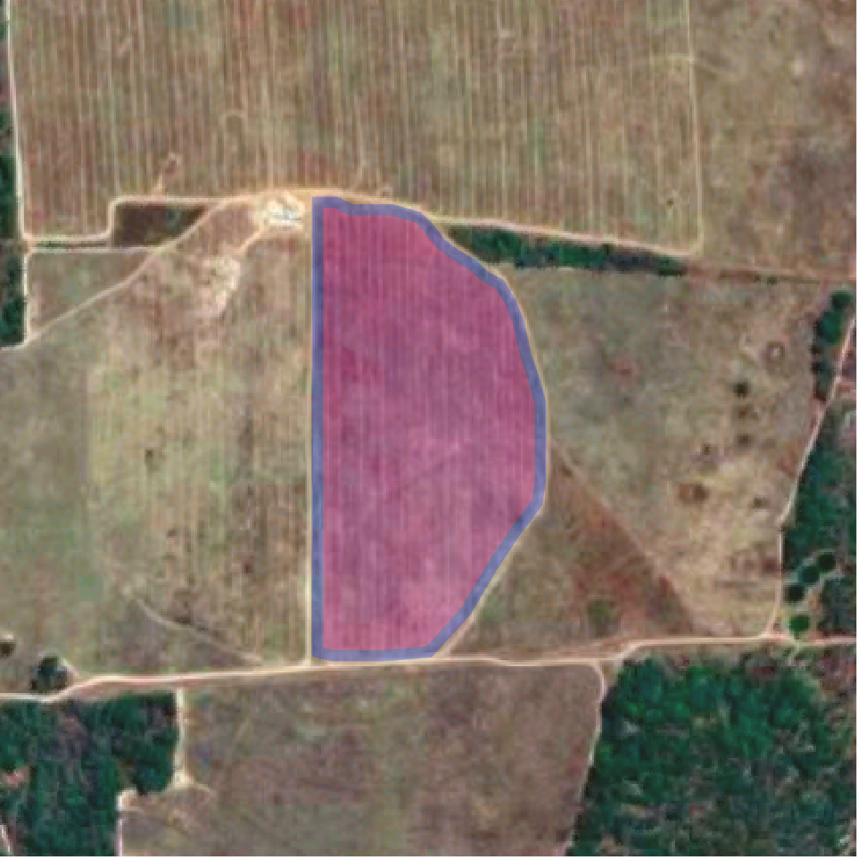

Proposed primary principles
###########################

Ground reference data should have the following properties to be usable as training data:

1. Be geographically specific
2. Use consistent classes
3. Include metadata for replicability
4. Have clear usage licenses
5. Follow correct formatting

Geographic Specificity
######################

Minimum requirements
********************

With regards to location, ground reference data must:

- Include specific coordinates where a classification was identified on the ground
  - In cases where data is geographically anonymized, it must be tied to an image specifically
- Refer to only one class, and that class must be what is within the boundaries of the polygon
- Have discrete geometry, such that one record cannot be conflated with another
- Refer to a specific and discrete geometric area, such that pixels can be determined to be in or out of the geometry

Individual data entries must be tied to a specific geocoded location and should be mutually exclusive of each other. In other words, every data record should refer to the classification of one and only one area. An exception is in cases where there is an intercropping practice within a plot in which the entry for that plot should have multiple crop type names.

To be useful, the data points and shapes collected do not need to be located next to each other. Instead, ensuring that the data records are discrete (i.e. with no overlaps) is more important. Getting a diverse and representative sample from locations around the study region is a necessity to build a model that can capture the heterogeneity of the target variable in space and time. Samples that are not representative will result in models that have biased prediction.

Preferred practices
*******************

To that end, careful and clear data collection methods are critical. When collecting data expressly for the purpose of training data, a practitioner should use a GPS enabled device (ideally a high-accuracy device; a calibrated and tested mobile phone can also be used). The area can be of any size, but ideally should be at least 20 meters in both length and width so that it can be matched with Sentinel-2 satellite imagery (best spatial resolution among open satellite data at 10 m per pixel).

The most accurate method is a continuous GPS trace of a zone, such as a field (Figure 1). This involves holding a GPS device and walking around the perimeter of the area of classification. The field worker should be careful not to include other classifications when walking around a field.

  **Figure 1: Active Trace**

  *When possible, tracing a field using a device that actively collects points is ideal. Note that the line is inside rather than on the border, to ensure that the shape is entirely one class. For training data purposes, it is preferable to leave part of the field out rather than include something that isn’t part of the field.*

|

.. figure:: Figures/Figure_6_Missed_Corner.png
  :width: 50

  **Figure 6: Missed Corner**

  *When performing a manual trace, it is critical to not miss any corners. In this instance, the field collector included parts several fields south that would be included as false positives. If time is a critical factor, quadrilateral samples may be a more accurate method to use, since the collection of four points is a simpler target, taking care to ensure that only one class is included.*

|

Traces that use point collection (where the field practitioner must press a ‘collect’ button for every point on the shape) must be done carefully so that no other classes or overlaps occur (Figure 2). The practitioner should be careful to get every corner, including interior corners (Figure 6).

In some cases, practitioners will collect a single GPS point while in the field and then use satellite or drone imagery to draw a polygon around the field. In such cases, recent high resolution imagery is preferred and in all cases the imagery metadata including source, date of acquisition, resolution, and platform should be recorded (and if available a cloud-based URI).

In cases where it is not possible to capture the full extent of a class (e.g. there is an obstacle near the farm boundary), a rectangular or quadrilateral shape inside the area is recommended that makes sure to include only the one class. Some examples of alternative geographic definition methods include sample squares and points with a fixed-radius circle that includes only a single class of variable (Figures 3 and 4). For agricultural data, that radius should be at least 30 m.

Some practitioners will take a geographic point while on the road and a heading of the direction of the field they are classifying. Such cases require great care to ensure that these records can be identified with certainty with an actual polygon.

In less ideal cases, the record should be ensured to contain only the specified classification and not to overlap with other classifications. In a case where shapes overlap slightly, the overlapping areas should be removed from both shapes; in cases where there is significant overlap where the extent of the classification is unclear, both records should be deleted from the dataset (Figure 5, 8).

Critically, each record should describe what is actively present in the shape, and not what will be there or was there, nor what was observable in a different location from that area.

Class Consistency
#################

Minimum requirements
********************

In order to be used for machine learning, the classification of each record must follow consistent guidelines. Each dataset must:

- Have clear guidelines on how each record is classified
- If the classifications are discrete, they must be completely disambiguated, such that there is no possibility that two different classes could be assigned. Such cases call for a new class, which may be the label that simply combines the classes (i.e. Maize and Groundnuts that are intercropped would end up as its own class, separate from Maize and from Groundnuts).
- If the classifications are continuous, the accuracy and precision of the measurement must be accounted for.

Preferred Practices
*******************

To maximize dataset usefulness, the classification used for the dataset needs to should follow a well-formed classification schema. For land cover, we recommend using the ML4GD Working Group schema. For crop data, we recommend using the FAO AGROVAC URIs for the crop to ensure cross-domain specificity, as well as including information about growth stages, most of which exist as AGROVAC concepts.

In cases without consensus classification schema, having established classification criteria is critical for the field collector in order to ensure that the class is replicable. They should be clear and documented.

For measurements such as crop yield, which requires the surveyor to perform crop cut and record the crop yield, the crop cut process should be documented and devices used for weighing the crop yield should also be of similar accuracy and documented.

When sampling from agricultural farms with intercropping, there should be separate fields for dominant crops (or crop if it’s only one dominant crop) and their associated crop data such as ‘Dominant Crop 1’, ‘Date 1’ and ‘Dominant Crop 2’, ‘Date 2’. If more than two crops are planted in the same field they can be added as extra fields, while being distinguished from the dominant crop.

Metadata for Replicability
##########################

Datasets require sufficient metadata to explain how the data was collected and to make it usable in machine learning applications. As such, the following metadata fields are required:

**Date** | Each record should include the date (and preferably time) that it was collected. Collection dates, which should be as specific as possible, are acceptable for the entire dataset as well.

**Coordinate System** | The coordinate system used to record the original GPS records must be included. The preferred system is latitude and longitude values in World Geodetic System (WGS 1984) format which is the standard system in most of the GPS devices.

**Methods** | The dataset should include a description of the methodology for data collection in order to inform data consumers how to use the data. Potential elements to include are how shapes were determined and recorded, what classification schema was used and any guidelines for determining classification, and ideally who executed the survey and using what devices.

**Classification Fields** | These include information that the field collector will record (such as crop type, crop yield, dates of farming, land cover class, etc). Each class should be recorded as a single string and the same name should be used consistently for a class across the dataset. In agricultural cases, separate fields for planting and harvest dates should be recorded. Planting date and harvest date is very important to record when known. When standard ontologies (such as AGROVAC URIs) are used, plain language fields should be separated and marked.

**Organization** | Name of the organization responsible for data collection, and name and contact information of the person who can provide more information about the data should be included.

**Data Field Definitions** | Each of the fields that are recorded in the dataset should be defined in the metadata so users can understand and use them accordingly.

**Description** (optional) | Description of the dataset, including the reasons for the initial data collection, details on the data collection, and funding/impact statements may be included.

**Consent** (optional) | The parameters of the consent for data use granted by people and property surveyed.

**License** | List the license attached to the data (See Section 4)

Data License
############

The dataset should have a very clear license for use. The license should address who can use the data and what restrictions on data usage exist (or don’t). For example, the license should address whether the data can be used for commercial and/or non-commercial purposes, or by academics or governments.

To increase the impact of collected data, we recommend the data license to be as open as possible. Open data allows for any user to make something valuable from the previous work, and increases the impact the initial collection has. The recommended open data license is Creative Commons (particularly CC-BY).

Additionally, consideration should be taken to the data collector’s rights to the information collected. Data should only be shared and licensed by practitioners that have the rights and permissions to share that data. Considerations of anonymization of individual identities should be undertaken without changing (or blurring) the geographic location of the data.

Format
######

The dataset should be cleaned and well-formed, particularly with all required metadata included. Any geographic file format can be used to record the data, including GeoJSON, Shapefile, and CSV.

Data descriptions should be in machine readable formats when possible, such as a GeoJSON or an attached XML file. Attached human readable description files, such as a PDF, are welcome but secondary.

When possible, we recommend using GeoJSON, since all data and metadata can be contained within a single file, without concerns about zipped folders. GeoJSON is also compatible with many current standards.
